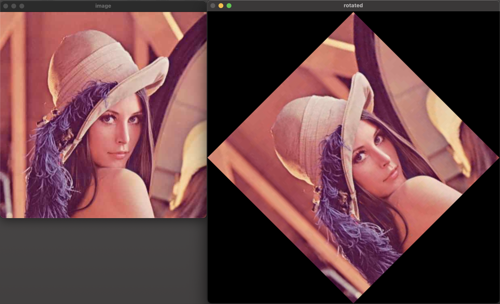
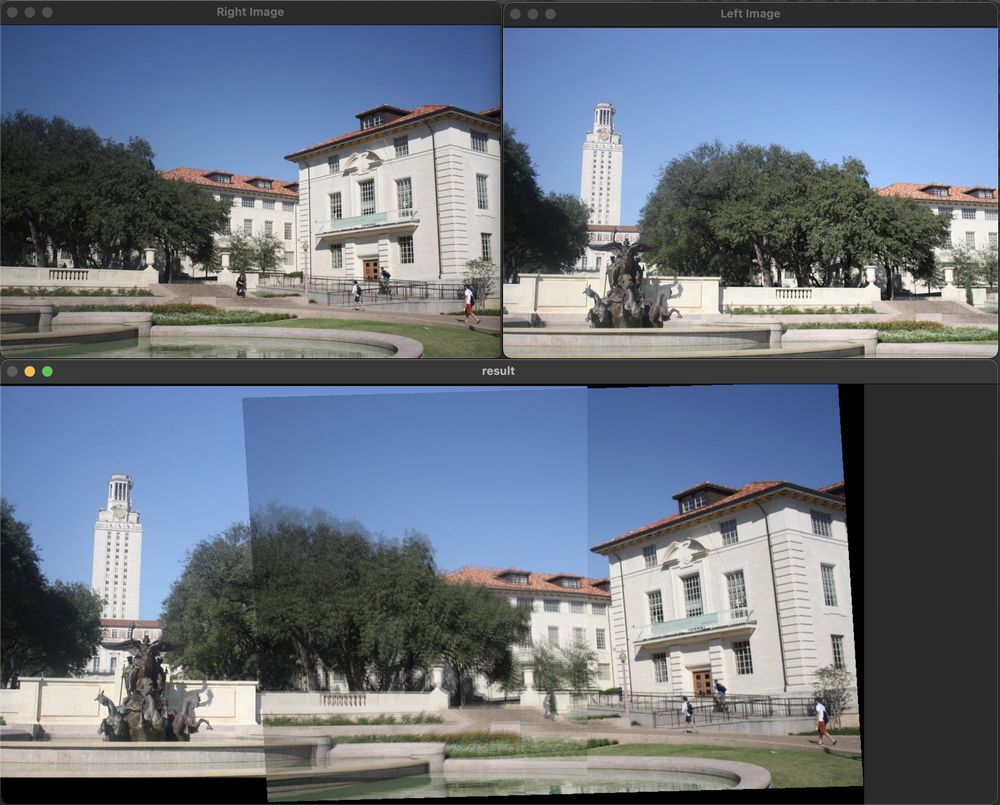

## I. Image Rotation
---
### I.1 이론적 배경
> 본 보고서는 OpenCV를 통해 하나의 이미지를 NN 보간법과 Bilinear 보간법을 활용하여 회전시키는 소스 코드인 "rotate_skeleton_v2.cpp" 에 대한 설명을 담고 있다.

이미지를 회전시킬 때는 각 픽셀을 좌표계로 대응시켜 Euclidean Transformation을 적용한다.

$$
R=
\left(
\begin{array}{cc}
\cos\theta & -\sin\theta \\
\sin\theta & \cos\theta
\end{array}
\right)
$$

이 경우, 기존 좌표에 대응하는 회전된 좌표가 정수(`int`)가 아닌 부동소수점(`float`)형태로 표현되어, 회전한 이미지의 픽셀을 표현할 수 없게 된다. 

이 과정에서 부동소수점으로 표현된 픽셀의 좌표를 정수로 변환하는 과정 즉, 보간(Interpolation)이 필요한데, 본 과제에서는 Nearest Neighbor(NN) 보간법과 Bilinear 보간법을 활용하여 이미지를 회전하였다.
<br>
<br>

### I.2 구현방법

#### I.2.1 Nearest Neighbor(NN) Interpolation
NN 보간법은 부동소수점 좌표를 가장 가까운 정수 좌표로 반올림하여, 해당 위치의 픽셀 값을 그대로 사용하는 방식이다.
이 방법은 연산량이 적고 구현이 간단하지만, 회전 시 계단 현상(aliasing)이나 경계 왜곡이 발생할 수 있다.

$$ (x',y')=(round(x),round(y)) $$ 

<span style="color:gray"><i>*$round()$: 가장 가까운 픽셀로 좌표를 정수화하는 함수</i></span>

```cpp
int nnx = round(x);
int nny = round(y);
output.at<T>(i, j) = input.at<T>(nny, nnx);
```


#### I.2.2 Bilinear Interpolation
입력 이미지에선 픽셀 좌표가 정수지만, 변환 후엔 실수 좌표가 반환될 수 있다. 하지만 해당 위치를 표현할 수 있는 픽셀이 존재하지 않을 수 있다. 이때, 그 좌표를 감싸는 4개의 정수 좌표 픽셀을 찾아서 현재 위치 $(x, y)$를 감싸는 네 개의 픽셀을 기준으로, 가중평균하여 중간값을 계산하는 방식이다.

이 방식은 NN보다 계산이 복잡하지만, 회전 시 경계가 부드럽고 자연스럽게 처리되는 장점이 있다.
<br>
반환한 현재 위치를 $(x,y)$ 라고 하면, 이 좌표를 감싸면서 정수로 이루어진 좌표 4개를 설정해야 한다. 
이 과정은 ``floor()``와 ``ceil()``을 통해 이루어진다.
- ``floor(x)``: ``x``보다 작거나 같은 가장 큰 정수 (왼쪽 끝 값의 좌표) 
- ``ceil(x)``: ``x``보다 크거나 같은 가장 작은 정수 (오른쪽 끝 값의 좌표)


$$ f(x, y) = (1 - \lambda)(1 - \mu) \cdot Q_{11} + \lambda(1 - \mu) \cdot Q_{21} + (1 - \lambda)\mu \cdot Q_{12} + \lambda\mu \cdot Q_{22} $$

$$
\lambda = x - \lfloor x \rfloor,\quad
\mu = y - \lfloor y \rfloor
$$


```cpp
float x1 = floor(x);
float y1 = floor(y);
float x2 = ceil(x);
float y2 = ceil(y);
```

<br>
이 과정을 통해 생성된 4개의 좌표의 가중치의 평균값을 구하여 보간한다.

```cpp
float dx = x - x1, dy = y - y1;

output.at<T>(i, j) =
(1 - dx) * (1 - dy) * input.at<T>(y1, x1) +
    dx * (1 - dy) * input.at<T>(y1, x2) +
    (1 - dx) * dy * input.at<T>(y2, x1) +
    dx * dy * input.at<T>(y2, x2);

```
<br>
<br>
<br>

## II. Image Stitching
---
### II.1 이론적 배경
> 본 보고서의 두 번째 부분은 "stitching.cpp"에 대한 설명으로, 두 개의 이미지를 자연스럽게 이어붙여 하나의 파노라마 이미지를 생성하는 방법을 다룬다.

본 코드에서는 아핀 변환(Affine Transformation)을 활용하여 두 이미지 간의 관계를 모델링한다. 아핀 변환은 다음과 같은 형태로 표현할 수 있다:

$$
\begin{pmatrix} x' \\ y' \end{pmatrix} = 
\begin{pmatrix} 
a_{11} & a_{12} & a_{13} \\ 
a_{21} & a_{22} & a_{23}
\end{pmatrix}
\begin{pmatrix} x \\ y \\ 1 \end{pmatrix}
$$

이 변환은 회전, 크기 조정, 평행이동 등을 포함한다.
<br>
<br>

### II.2 구현방법

#### II.2.1 어파인 변환 행렬 계산
두 이미지 간의 대응점(correspondence points)을 이용하여 아핀 변환 행렬을 계산한다. 본 코드에서는 두 이미지에서 28개의 대응점을 수동으로 지정하고, 이를 기반으로 최소 제곱법을 사용하여 변환 행렬을 구한다.

```cpp
Mat A12 = cal_affine<float>(ptl_x, ptl_y, ptr_x, ptr_y, 28);
Mat A21 = cal_affine<float>(ptr_x, ptr_y, ptl_x, ptl_y, 28);
```

여기서 `A12`는 왼쪽 이미지에서 오른쪽 이미지로의 변환, `A21`은 오른쪽 이미지에서 왼쪽 이미지로의 변환을 나타낸다.

소스코드에서 아핀 변환 행렬 계산 함수는 다음과 같다:

```cpp
template <typename T>
Mat cal_affine(int ptl_x[], int ptl_y[], int ptr_x[], int ptr_y[], int number_of_points) {
    Mat M(2 * number_of_points, 6, CV_32F, Scalar(0));
    Mat b(2 * number_of_points, 1, CV_32F);
    
    // 행렬 초기화
    for (int i = 0; i < number_of_points; i++) {
        M.at<T>(2 * i, 0) = ptl_x[i];       M.at<T>(2 * i, 1) = ptl_y[i];       M.at<T>(2 * i, 2) = 1;
        M.at<T>(2 * i + 1, 3) = ptl_x[i];   M.at<T>(2 * i + 1, 4) = ptl_y[i];   M.at<T>(2 * i + 1, 5) = 1;
        b.at<T>(2 * i) = ptr_x[i];          b.at<T>(2 * i + 1) = ptr_y[i];
    }
    
    // 최소 제곱법 적용 및 계산: (M^T * M)^(−1) * M^T * b
    transpose(M, M_trans);
    invert(M_trans * M, temp);
    affineM = temp * M_trans * b;
    
    return affineM;
}
```

이 함수는 최소 제곱법을 사용하여 대응점들에 대해 가장 잘 맞는 아핀 변환 행렬을 계산한다.

#### II.2.2 결과 이미지 경계 계산
변환된 이미지의 크기와 위치를 결정하기 위해, 변환 행렬을 사용하여 오른쪽 이미지의 네 모서리가 어디에 위치하게 될지 계산한다.

```cpp
Point2f p1(A21.at<float>(0) * 0 + A21.at<float>(1) * 0 + A21.at<float>(2), A21.at<float>(3) * 0 + A21.at<float>(4) * 0 + A21.at<float>(5));
Point2f p2(A21.at<float>(0) * 0 + A21.at<float>(1) * I2_row + A21.at<float>(2), A21.at<float>(3) * 0 + A21.at<float>(4) * I2_row + A21.at<float>(5));
Point2f p3(A21.at<float>(0) * I2_col + A21.at<float>(1) * I2_row + A21.at<float>(2), A21.at<float>(3) * I2_col + A21.at<float>(4) * I2_row + A21.at<float>(5));
Point2f p4(A21.at<float>(0) * I2_col + A21.at<float>(1) * 0 + A21.at<float>(2), A21.at<float>(3) * I2_col + A21.at<float>(4) * 0 + A21.at<float>(5));
```

이러한 계산을 통해 결과 이미지의 전체 범위를 결정한다:

```cpp
int bound_u = (int)round(min(0.0f, min(p1.y, p4.y)));
int bound_b = (int)round(max(I1_row-1, max(p2.y, p3.y)));
int bound_l = (int)round(min(0.0f, min(p1.x, p2.x)));
int bound_r = (int)round(max(I1_col-1, max(p3.x, p4.x)));
```

이렇게 계산된 경계를 사용하여 최종 결과 이미지를 초기화한다:

```cpp
Mat I_f(bound_b - bound_u + 1, bound_r - bound_l + 1, CV_32FC3, Scalar(0));
```

#### II.2.3 역방향 매핑과 Bilinear Interpolation
최종 이미지의 각 픽셀에 대해, 어파인 변환을 통해 오른쪽 이미지에서의 위치를 계산하고, Bilinear 보간을 사용하여 픽셀 값을 결정한다.

```cpp
for (int i = bound_u; i <= bound_b; i++) {
    for (int j = bound_l; j <= bound_r; j++) {
        float x = A12.at<float>(0) * j + A12.at<float>(1) * i + A12.at<float>(2) - bound_l;
        float y = A12.at<float>(3) * j + A12.at<float>(4) * i + A12.at<float>(5) - bound_u;

        float y1 = floor(y);
        float y2 = ceil(y);
        float x1 = floor(x);
        float x2 = ceil(x);

        float mu = y - y1;
        float lambda = x - x1;

        if (x1 >= 0 && x2 < I2_col && y1 >= 0 && y2 < I2_row)
            I_f.at<Vec3f>(i - bound_u, j - bound_l) = lambda * (mu * I2.at<Vec3f>(y2, x2) + (1 - mu) * I2.at<Vec3f>(y1, x2)) +
                                                     (1 - lambda) *(mu * I2.at<Vec3f>(y2, x1) + (1 - mu) * I2.at<Vec3f>(y1, x1));
    }
}
```

여기서도 I.2.2에서 설명한 Bilinear 보간법과 동일한 방식을 사용하여 보간을 수행한다. 

#### II.2.4 알파 블렌딩
두 이미지가 겹치는 영역에서는 알파 블렌딩(alpha blending)을 적용한다. 이는 두 이미지의 가중 평균을 계산하여 픽셀 값을 결정하는 기술이다.

```cpp
void blend_stitching(const Mat I1, const Mat I2, Mat &I_f, int bound_l, int bound_u, float alpha) {
    // I2는 이미 inverse warping으로 I_f에 있음
    for (int i = 0; i < I1.rows; i++) {
        for (int j = 0; j < I1.cols; j++) {
            // I2의 이미지가 있는지 확인
            bool cond_I2 = I_f.at<Vec3f>(i - bound_u, j - bound_l) != Vec3f(0, 0, 0) ? true : false;
            
            if (cond_I2)
                // 겹치는 부분: 알파 블렌딩
                I_f.at<Vec3f>(i - bound_u, j - bound_l) = alpha * I1.at<Vec3f>(i, j) + (1 - alpha) * I_f.at<Vec3f>(i - bound_u, j - bound_l);
            else
                // 겹치지 않는 부분: I1 이미지 사용
                I_f.at<Vec3f>(i - bound_u, j - bound_l) = I1.at<Vec3f>(i, j);
        }
    }
}
```

알파 블렌딩에서 `alpha` 값은 블렌딩 비율을 결정한다:
- `alpha = 0.5`: 두 이미지를 균등하게 혼합
- `alpha = 0.0`: 겹치는 부분에서 오른쪽 이미지만 사용
- `alpha = 1.0`: 겹치는 부분에서 왼쪽 이미지만 사용

본 코드에서는 `alpha = 0.5`를 사용하여 두 이미지가 자연스럽게 혼합되도록 하였다.
<br>
<br>


## III. 구현 결과
---
### III.1 ``rotate_v2.cpp``


### III.2 ``stitching.cpp``


<br>
<br>
<br>
<br>
<br>
<br>

## IV. etc
---
### OpenCV + C++ + VSCode on macOS (Apple Silicon) 트러블슈팅

#### 환경

- **Device:** M2 MacBook Air
- **IDE:** VSCode
- **Compiler:** g++ (Apple clang)
- **OpenCV 설치:** Homebrew
- **기본 폴더 구조:**

```
2025-1_OSP-hw/
├── hw1/
│   ├── main.cpp
│   └── lena.png
├── hw2/
└── .vscode/
    └── tasks.json
```

---

##### 문제 1. `opencv2/opencv.hpp` file not found

###### 🔍 원인

- OpenCV는 설치되었지만, 헤더 경로가 컴파일에 포함되지 않음

###### 💡 해결

```bash
g++ main.cpp -std=c++11 -o main \
-I/opt/homebrew/opt/opencv/include/opencv4 \
-L/opt/homebrew/opt/opencv/lib \
-lopencv_core -lopencv_imgcodecs -lopencv_imgproc -lopencv_highgui
```

###### 문제 2. C++11 에러 (OpenCV 4.x+ requires enabled C++11 support)

###### 🔍 원인

- `-std=c++11` 옵션이 누락됨

###### 💡 해결

- 컴파일 시 반드시 `-std=c++11` 추가!

###### 문제 3. lena.png 못 불러옴 (image.empty())

###### 🔍 에러 메시지

```
imread_('lena.png'): can't open/read file: check file path/integrity
```

###### 💡 해결

- main.cpp와 같은 디렉토리에 lena.png가 있어야 함
- 없는 경우:
    
    ```bash
    curl -o lena.png https://upload.wikimedia.org/wikipedia/en/7/7d/Lenna_%28test_image%29.png
    ```
    
- 코드에 예외처리 추가 추천:
    
    ```cpp
    if (image.empty()) {    std::cerr << "이미지를 불러오지 못했습니다." << std::endl;    return -1;}
    ```
    

###### 문제 4. 폴더 이름에 괄호가 있어서 컴파일 오류 발생

##### 🔍 원인

- `(2025-1)`처럼 괄호 있는 폴더명은 터미널과 컴파일러에서 경로 인식 문제 발생

###### 💡 해결

- 폴더명 변경:
    - `(2025-1) OSP-hw` → `2025-1_OSP-hw`

###### 문제 5. VSCode tasks.json에서 main.cpp 못 찾음

###### 🔍 원인

- 작업 디렉토리(cwd)가 main.cpp가 있는 폴더와 다름

###### 💡 해결

```json
"options": {
  "cwd": "${fileDirname}"
}
```

###### 문제 6. 여러 과제 폴더(hw1, hw2, ...)에 대해 자동 빌드 설정

###### 💡 해결

.vscode/tasks.json을 아래처럼 설정:

```json
{
  "version": "2.0.0",
  "tasks": [
    {
      "label": "Build OpenCV Project (Current File)",
      "type": "shell",
      "command": "g++",
      "args": [
        "-std=c++11",
        "${file}",
        "-o",
        "${fileDirname}/${fileBasenameNoExtension}",
        "-I/opt/homebrew/opt/opencv/include/opencv4",
        "-L/opt/homebrew/opt/opencv/lib",
        "-lopencv_core",
        "-lopencv_imgcodecs",
        "-lopencv_imgproc",
        "-lopencv_highgui"
      ],
      "options": {
        "cwd": "${fileDirname}"
      },
      "group": {
        "kind": "build",
        "isDefault": true
      },
      "problemMatcher": []
    }
  ]
}
```

###### 💡 사용 방법

- VSCode에서 `2025-1_OSP-hw` 전체 열기
- `hw1/main.cpp`, `hw2/main.cpp` 등 열고
- `Cmd + Shift + B`로 자동 빌드
